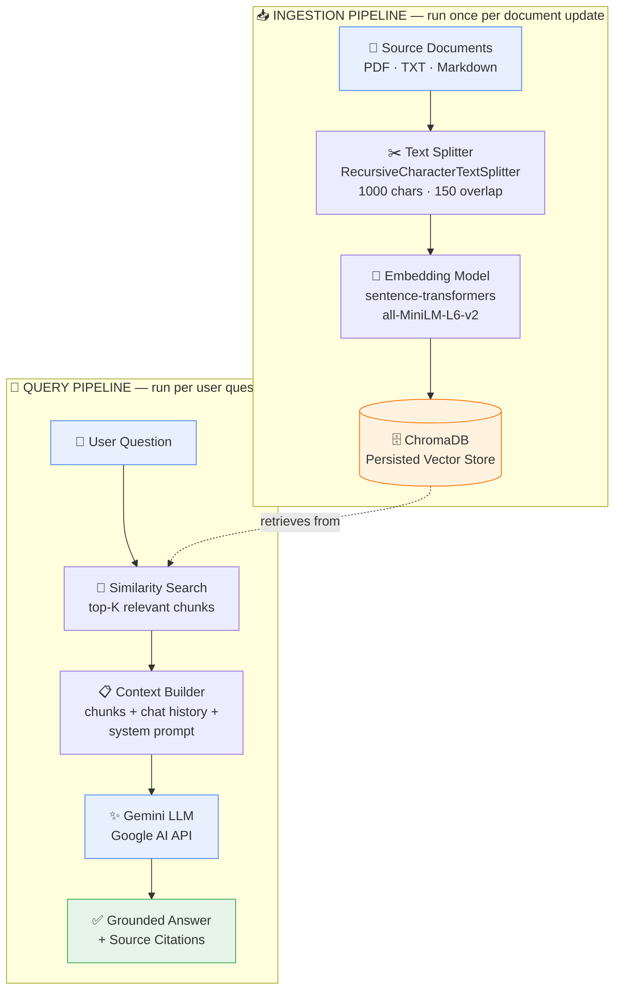

<div align="center">

# 📚 RAG Chatbot
### Retrieval-Augmented Generation over Your Own Documents

Ask questions in plain English and get answers grounded in *your* private documents —
with citations, not hallucinations.

[](https://www.python.org/)
[](https://www.langchain.com/)
[](https://www.trychroma.com/)
[](https://ai.google.dev/)
[](https://streamlit.io/)
[](LICENSE)

**[🚀 Live Demo](https://pcd0015-rag-chatbot-app-9rph54.streamlit.app/)** · [Features](#-features) · [Architecture](#-architecture) · [Getting Started](#-getting-started) · [Usage](#-usage)

</div>

---

## 🧭 Introduction

Large Language Models are powerful, but they only know what they were trained
on — they can't answer questions about your internal documents, private
notes, or anything published after their training cutoff, and they'll
confidently make things up when they don't know.

**Retrieval-Augmented Generation (RAG)** solves this by pairing an LLM with a
search step over your own data: instead of asking the model to answer from
memory, the system first retrieves the most relevant passages from your
document collection, then asks the model to answer *using only that
retrieved context*.

This project is a complete, working implementation of that pattern — not a
toy demo. It ingests real documents (PDF, TXT, Markdown), chunks and embeds
them into a vector database, retrieves the most relevant chunks for any
question, and generates a grounded, cited answer using **Google's Gemini
API**. It ships with both a terminal interface and a full web UI, and it's
structured the way a production RAG service would be: config-driven,
modular, and documented.

**Try it now:** 👉 **[pcd0015-rag-chatbot-app-9rph54.streamlit.app](https://pcd0015-rag-chatbot-app-9rph54.streamlit.app/)**

---

## ✨ Features

- 🔍 **Semantic search, not keyword search** — finds relevant content even when your question doesn't share exact wording with the source document
- ✂️ **Smart chunking** — overlapping text splits that preserve context across chunk boundaries
- 🧠 **Local embeddings** — document ingestion runs entirely offline and free, using `sentence-transformers`
- 💾 **Persistent vector store** — embed once, query forever, powered by ChromaDB
- 📎 **Source citations on every answer** — filename, relevance score, and the exact snippet used, so nothing is a black box
- 💬 **Multi-turn conversation memory** — follow-up questions understand prior context
- 🚫 **Hallucination guardrails** — the system prompt forces the model to say "I don't know" instead of guessing when context is insufficient
- 🖥️ **Two interfaces** — a scriptable CLI and a polished Streamlit web app with drag-and-drop document upload
- ⚙️ **Fully configurable** — model, chunk size, overlap, and retrieval depth are all environment variables, no code changes needed
- 💸 **Low-cost generation** — runs on Gemini's free-tier-friendly API, keeping this cheap to host and demo

---

## 🏗 Architecture

The pipeline has two phases: an **offline ingestion phase** (run once, or whenever documents change) and an **online query phase** (run for every user question).



**Design rationale:**

| Design choice | Why |
|---|---|
| Chunking with overlap (1000 / 150) | Preserves context across chunk boundaries so answers aren't cut off mid-thought |
| Local embeddings (`all-MiniLM-L6-v2`) | Ingestion is free and works offline — only the final answer generation step calls a paid/rate-limited API |
| ChromaDB persisted to disk | Embed once, query many times, without re-processing documents on every run |
| Gemini for generation | Fast, low-cost, generous free tier — good fit for a demo/portfolio deployment |
| Relevance-scored citations | Every answer is auditable — you can see exactly which document and passage it came from |
| Grounded system prompt | Explicitly instructs the model to decline rather than hallucinate when context is insufficient |

---

## 🛠 Tech Stack

| Layer | Technology |
|---|---|
| Language | Python 3.10+ |
| Orchestration | LangChain |
| Vector Database | ChromaDB |
| Embeddings | Sentence-Transformers (`all-MiniLM-L6-v2`), local & free |
| LLM | Google Gemini (`gemini-3.5-flash`) via `langchain-google-genai` |
| Web UI | Streamlit |
| Document Loaders | PyPDF, Unstructured (Markdown), native TextLoader |

---

## 📁 Project Structure

```
rag_chatbot/
├── config.py             # All settings, loaded from .env
├── ingest.py             # Load → chunk → embed → store pipeline
├── rag_pipeline.py       # Retrieval + generation logic (the "RAG" core)
├── cli.py                # Terminal chat interface
├── app.py                # Streamlit web UI (upload + chat)
├── data/                 # Put your source documents here
│   └── sample_notes.txt  # Example doc so the project works out of the box
├── chroma_db/             # Generated vector store (created after ingest)
├── requirements.txt
├── .env.example
└── README.md
```

---

## 🚀 Getting Started

### Prerequisites
- Python 3.10 or higher
- A [Google AI Studio API key](https://aistudio.google.com/app/apikey) (free tier available)

### 1. Clone the repository
```bash
git clone https://github.com/<your-username>/rag-chatbot.git
cd rag-chatbot
```

### 2. Install dependencies
```bash
python -m venv venv
source venv/bin/activate        # Windows: venv\Scripts\activate
pip install -r requirements.txt
```

### 3. Configure environment variables
```bash
cp .env.example .env
```
Then open `.env` and set:
```
GOOGLE_API_KEY=your_google_api_key_here
```

### 4. Add your documents
Drop `.pdf`, `.txt`, or `.md` files into the `data/` folder. A sample file
(`data/sample_notes.txt`) is included so you can test immediately without
adding anything of your own.

### 5. Build the vector index
```bash
python ingest.py
# or, to wipe and rebuild from scratch:
python ingest.py --reset
```
This downloads the local embedding model on first run (~90MB, one-time),
then chunks and embeds every document into `chroma_db/`.

---

## 💻 Usage

### Terminal
```bash
python cli.py
```

### Web UI
```bash
streamlit run app.py
```
Opens at `http://localhost:8501`. Upload new documents directly from the
sidebar — they're chunked, embedded, and added to the index live.

### 🌐 Or just use the hosted version
No install required — try it directly:
**[pcd0015-rag-chatbot-app-9rph54.streamlit.app](https://pcd0015-rag-chatbot-app-9rph54.streamlit.app/)**

---

## 🧪 Example Session

Using the included sample document (`data/sample_notes.txt`):

```
You: What's the API rate limit for enterprise customers?

Assistant: Enterprise tier customers have a rate limit of 5000 requests
per minute, compared to 1000 requests per minute for standard tier
customers. Requests over the limit get an HTTP 429 response with a
Retry-After header. [source: sample_notes.txt]

  Sources: sample_notes.txt
```

Try asking about the rollback window, on-call escalation times, or data
retention policy — all grounded in the actual document, with off-topic
questions correctly flagged as "not found in the provided context."

---

## ⚙️ Customization

| Want to... | Change this |
|---|---|
| Use a different Gemini model (e.g. `gemini-2.5-pro`) | `GEMINI_MODEL` in `.env` |
| Support more file types (e.g. `.docx`, `.html`) | Add a loader to `ingest.py`'s `loaders` list (LangChain ships 100+ built-in loaders) |
| Retrieve more/fewer chunks per answer | `TOP_K` in `.env` |
| Larger/smaller chunks | `CHUNK_SIZE` / `CHUNK_OVERLAP` in `.env` |
| Swap ChromaDB for Pinecone/FAISS | Replace the `Chroma(...)` calls in `ingest.py` and `rag_pipeline.py` — LangChain's vector store interface is consistent across providers |
| Use Claude or OpenAI instead of Gemini | Swap `ChatGoogleGenerativeAI` for `ChatAnthropic` / `ChatOpenAI` in `rag_pipeline.py` |
| Improve retrieval precision | Add a cross-encoder re-ranking step after `retrieve()` in `rag_pipeline.py` |

---

## 🎯 What This Project Demonstrates

- **Embeddings & semantic search** — converting text to vectors and matching by meaning, not keywords
- **Document chunking strategy** — balancing chunk size and overlap to preserve context without diluting retrieval precision
- **Vector database usage** — persistent storage, similarity search with relevance scoring, incremental re-indexing
- **LLM orchestration** — prompt engineering for groundedness, multi-turn conversation state, citation tracking
- **End-to-end product thinking** — not just a script, but a CLI, a deployed web app, configuration management, and a re-ingestion workflow a real user could operate

---

## 🗺 Roadmap / Known Limitations

- [ ] No multi-hop retrieval — similarity search alone can miss answers that require reasoning across many documents at once
- [ ] No re-ranking step — top-K chunks are used as retrieved; a cross-encoder re-ranker would improve precision on large corpora
- [ ] ChromaDB runs locally/embedded — for large-scale or multi-user production use, a managed vector DB (Pinecone, Weaviate Cloud, pgvector) would be a more realistic next step
- [ ] No streaming responses yet in the web UI

Contributions and PRs addressing any of the above are welcome.

---

## 🤝 Contributing

Contributions are welcome! Please open an issue first to discuss what you'd
like to change, then submit a pull request.

1. Fork the repo
2. Create your feature branch (`git checkout -b feature/amazing-feature`)
3. Commit your changes (`git commit -m 'Add amazing feature'`)
4. Push to the branch (`git push origin feature/amazing-feature`)
5. Open a Pull Request

---

## 📄 License

Distributed under the MIT License. See `LICENSE` for more information.

---

## 🙏 Acknowledgments

- [LangChain](https://www.langchain.com/) for orchestration primitives
- [ChromaDB](https://www.trychroma.com/) for the vector store
- [Google AI](https://ai.google.dev/) for the Gemini API
- [Sentence-Transformers](https://www.sbert.net/) for local embeddings

<div align="center">

**[⬆ back to top](#-rag-chatbot)**

</div>
